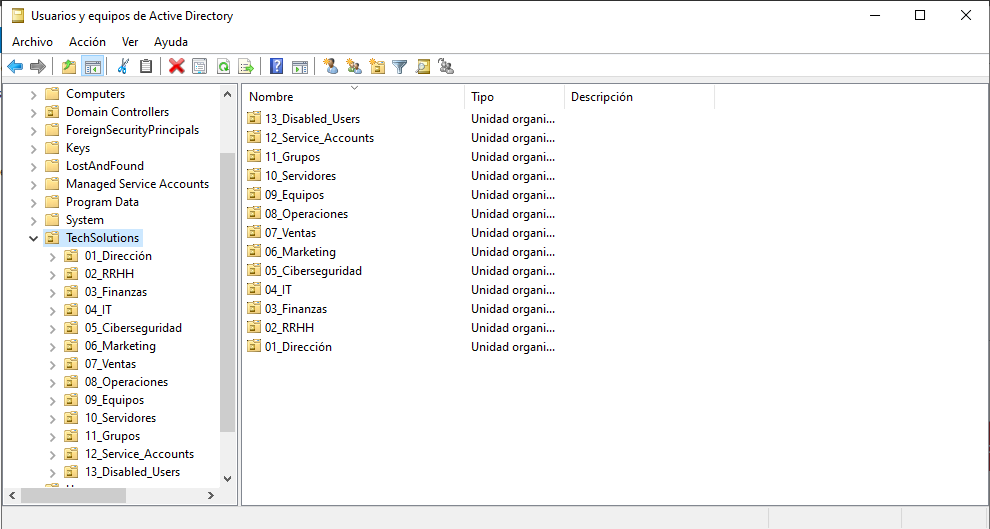
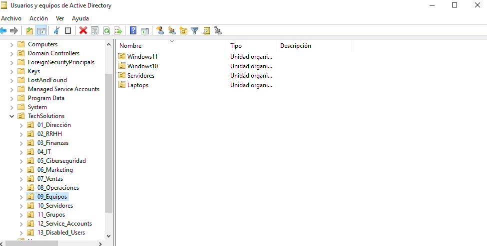
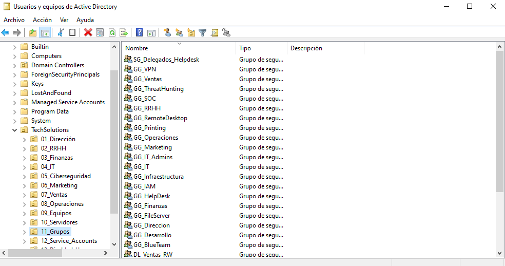
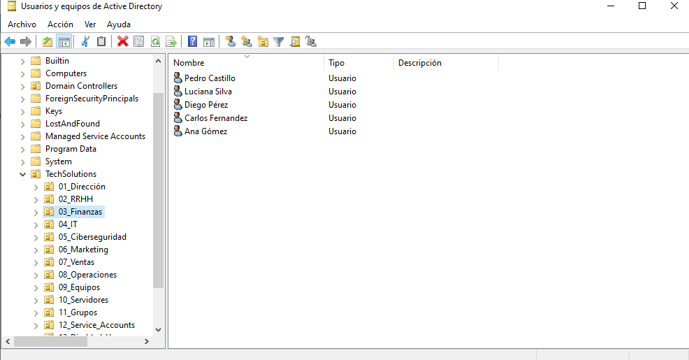

# 🏢 Active Directory

## 📌 Descripción

En esta fase se implementó y organizó la estructura de Active Directory para el dominio `techsolutions.local`.

El objetivo fue construir una estructura lógica y escalable que permitiera administrar usuarios, grupos y equipos de acuerdo con la estructura organizacional de una empresa.

---

## 🎯 Objetivos

- Implementar Active Directory Domain Services.
- Diseñar una estructura de Unidades Organizativas (OU).
- Separar usuarios, equipos y grupos según su función.
- Crear los grupos necesarios para posteriormente implementar AGDLP.
- Organizar los objetos de Active Directory de forma escalable.
- Validar la correcta creación y ubicación de los objetos.

---

# 🌐 Dominio

El dominio utilizado en el laboratorio es:

```text
techsolutions.local

```

# 📸 Evidencias

## 1. Estructura general de Active Directory

La estructura del dominio fue organizada mediante Unidades Organizativas (OU), separando las diferentes áreas y funciones de la organización.



---

## 2. Organización de equipos

Los equipos fueron separados en la OU `09_Equipos`, utilizando sub-OUs según el tipo de equipo y sistema operativo.



---

## 3. Organización de grupos

Los grupos de seguridad fueron centralizados en la OU `11_Grupos`, diferenciando los Global Groups (GG) de los Domain Local Groups (DL).



---

## 4. Organización de usuarios

Los usuarios fueron ubicados dentro de las OUs correspondientes a sus departamentos, permitiendo posteriormente asociarlos a los grupos globales correspondientes.


